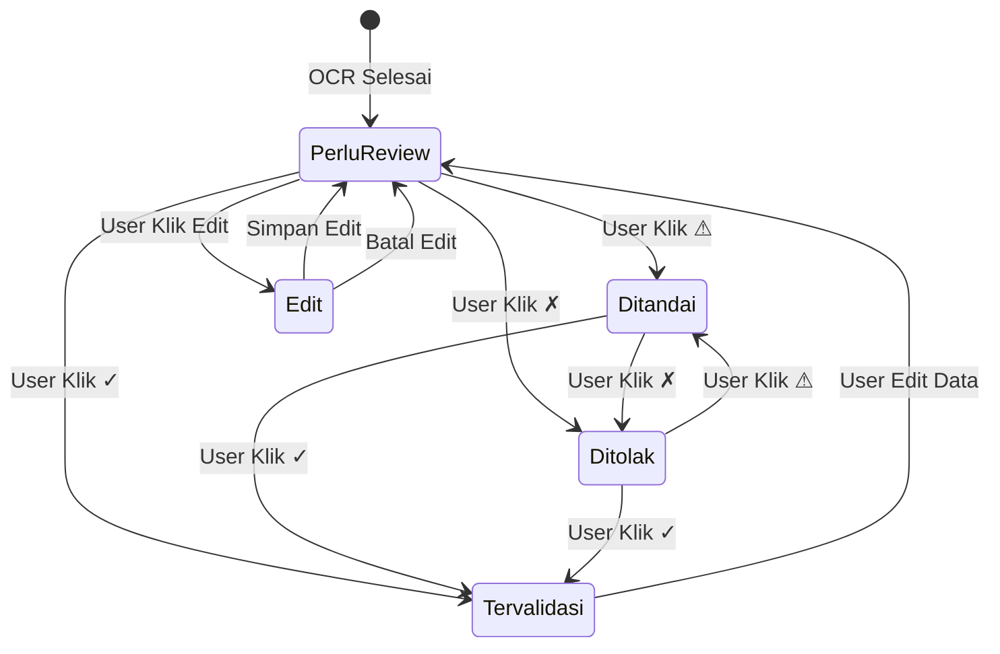
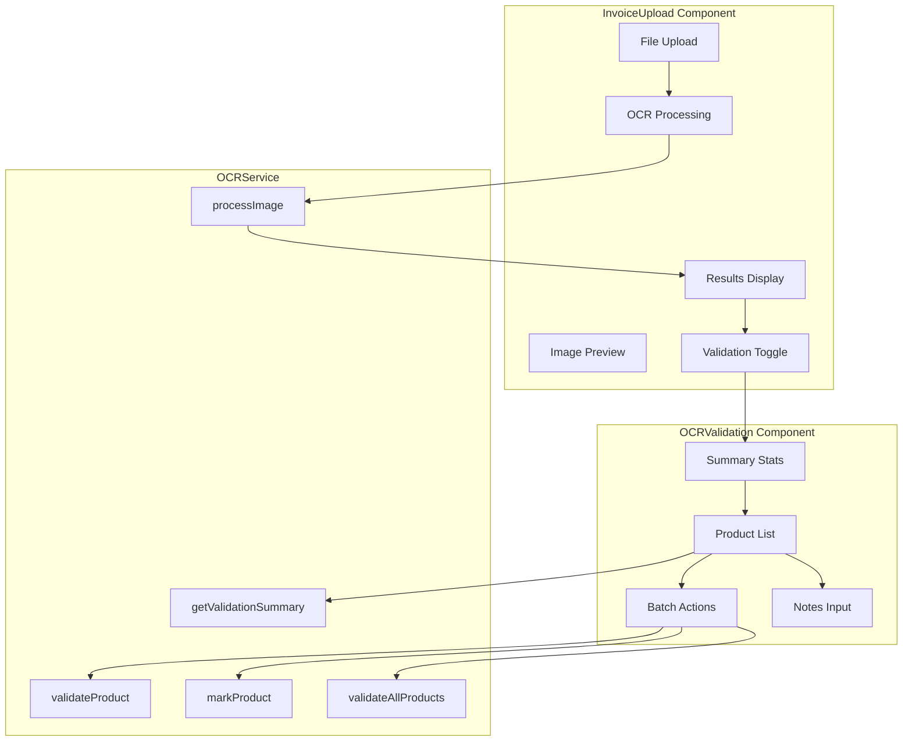
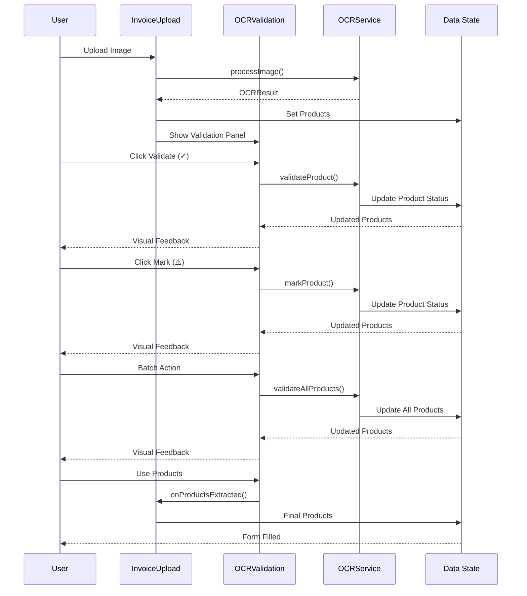

# Alur Kerja Fitur Mark OCR untuk Validasi Data

## Diagram Alur Kerja

```mermaid
flowchart TD
    A[Upload Gambar Invoice] --> B[Proses OCR dengan Tesseract.js]
    B --> C[Ekstrak Data Produk]
    C --> D[Set Status: Perlu Review]
    D --> E[Tampilkan Hasil OCR]
    E --> F{User Klik 'Tampilkan Validasi'?}
    
    F -->|Ya| G[Buka Panel Validasi OCR]
    F -->|Tidak| H[Tampilkan Produk dengan Status Visual]
    
    G --> I[Review Setiap Produk]
    I --> J{Action yang Dipilih}
    
    J -->|✓ Validasi| K[Set Status: Tervalidasi]
    J -->|✗ Tolak| L[Set Status: Ditolak]
    J -->|⚠ Tandai| M[Set Status: Ditandai]
    J -->|Edit| N[Buka Form Edit Inline]
    
    N --> O[Update Data Produk]
    O --> P[Set Status: Perlu Review]
    
    K --> Q[Update Summary Validasi]
    L --> Q
    M --> Q
    P --> Q
    
    Q --> R{Ada Batch Action?}
    R -->|Ya| S[Terapkan ke Semua Produk]
    R -->|Tidak| T[Kembali ke Review]
    
    S --> Q
    T --> I
    
    Q --> U{User Klik 'Gunakan Produk'?}
    U -->|Ya| V[Kirim Data ke Form]
    U -->|Tidak| W[Lanjutkan Validasi]
    
    W --> I
    V --> X[Selesai - Data Siap Digunakan]
    
    H --> Y[User Klik 'Gunakan Produk']
    Y --> V
```

## Status Validasi



## Komponen dan Interaksi



## Data Flow



## Fitur Utama

### 1. Validasi Individual
- Setiap produk dapat divalidasi secara individual
- Status visual yang jelas (✓ ⚠ ⏳)
- Edit inline untuk data produk
- Catatan validasi per produk

### 2. Batch Actions
- Validasi semua produk sekaligus
- Tandai semua untuk review
- Reset semua tanda validasi
- Efisiensi untuk dataset besar

### 3. Visual Feedback
- Color coding untuk status
- Icons yang intuitif
- Progress indicators
- Hover effects dan animasi

### 4. Data Integrity
- Validasi input yang robust
- Error handling yang comprehensive
- State management yang konsisten
- Optimistic updates untuk UX

## Keunggulan

1. **Akurasi**: Memastikan data OCR akurat sebelum digunakan
2. **Efisiensi**: Batch actions untuk dataset besar
3. **Fleksibilitas**: Edit data dan tambah catatan
4. **User Experience**: Interface yang intuitif dan responsif
5. **Integrasi**: Terintegrasi dengan workflow yang ada
