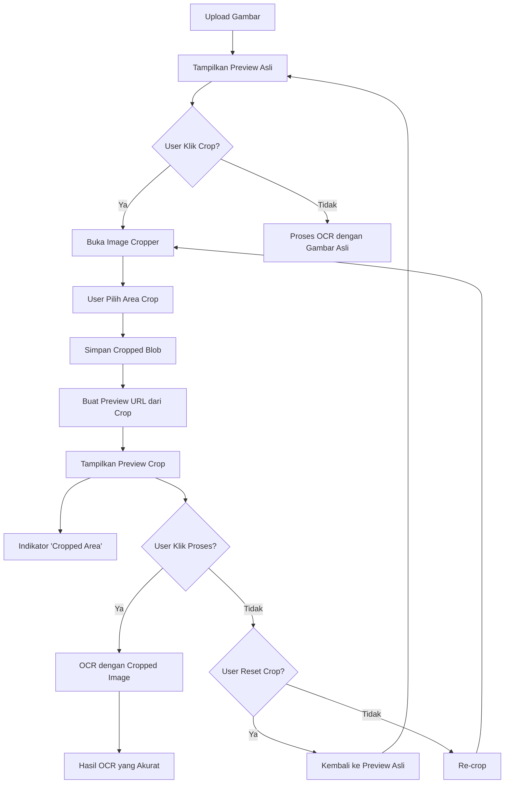

# Perbaikan Preview Gambar Crop - SplitBiller

## Masalah yang Diperbaiki

**Masalah**: Preview gambar masih menampilkan gambar asli setelah crop, bukan hasil crop. Ini bisa membingungkan OCR karena akan membaca teks dari seluruh gambar, bukan hanya area yang di-crop.

## Solusi yang Diimplementasikan

### 1. **Preview Gambar yang Tepat**
- Preview sekarang menampilkan hasil crop jika ada
- Fallback ke gambar asli jika belum di-crop
- Indikator visual yang jelas untuk status crop

### 2. **State Management yang Diperbaiki**
```typescript
const [croppedPreviewUrl, setCroppedPreviewUrl] = useState<string | null>(null);
```

### 3. **Preview URL dari Cropped Image**
```typescript
const handleCropComplete = (croppedBlob: Blob) => {
  setCroppedImageBlob(croppedBlob);
  
  // Buat preview URL dari cropped image
  const croppedUrl = URL.createObjectURL(croppedBlob);
  setCroppedPreviewUrl(croppedUrl);
  
  setShowCropper(false);
};
```

### 4. **Preview yang Dinamis**
```typescript

```

## Fitur Baru yang Ditambahkan

### 1. **Indikator Status Crop**
- Badge "Cropped Area" di pojok kiri atas preview
- Warna hijau untuk menunjukkan area yang sudah di-crop
- Icon crop untuk visual yang jelas

### 2. **Tombol Reset Crop**
- Tombol "Reset Crop" untuk kembali ke gambar asli
- Hanya muncul jika ada cropped image
- Warna orange untuk membedakan dari tombol lain

### 3. **Informasi OCR yang Jelas**
- Pesan yang menjelaskan gambar mana yang akan diproses
- "OCR akan memproses area yang di-crop (lebih akurat)" jika ada crop
- "OCR akan memproses seluruh gambar" jika tidak ada crop

### 4. **Tombol Re-crop**
- Tombol "Re-crop" jika sudah ada crop
- Tombol "Crop" jika belum ada crop
- Memudahkan user untuk mengubah area crop

## Keunggulan

### 1. **Akurasi OCR yang Lebih Baik**
- OCR hanya membaca area yang relevan
- Mengurangi noise dari teks yang tidak perlu
- Hasil ekstraksi yang lebih akurat

### 2. **User Experience yang Lebih Baik**
- Preview yang sesuai dengan yang akan diproses
- Indikator visual yang jelas
- Kontrol yang mudah untuk crop dan reset

### 3. **Memory Management yang Baik**
- Cleanup URL object yang proper
- Mencegah memory leak
- useEffect untuk cleanup saat unmount

## Alur Kerja yang Diperbaiki



## Kode yang Diperbaiki

### 1. **State Management**
```typescript
const [croppedPreviewUrl, setCroppedPreviewUrl] = useState<string | null>(null);
```

### 2. **Preview Dinamis**
```typescript

```

### 3. **Cleanup Memory**
```typescript
useEffect(() => {
  return () => {
    if (previewUrl) URL.revokeObjectURL(previewUrl);
    if (croppedPreviewUrl) URL.revokeObjectURL(croppedPreviewUrl);
  };
}, [previewUrl, croppedPreviewUrl]);
```

### 4. **Indikator Visual**
```typescript
{croppedPreviewUrl && (
  <div className="absolute top-2 left-2 bg-green-600 text-white px-2 py-1 rounded-md text-xs font-medium flex items-center gap-1">
    <Crop className="w-3 h-3" />
    Cropped Area
  </div>
)}
```

## Hasil

✅ **Preview gambar sekarang menampilkan hasil crop yang tepat**
✅ **OCR memproses area yang di-crop untuk akurasi lebih tinggi**
✅ **Indikator visual yang jelas untuk status crop**
✅ **Kontrol yang mudah untuk crop dan reset**
✅ **Memory management yang proper**

Sekarang user dapat melihat preview yang sesuai dengan yang akan diproses OCR, sehingga hasil ekstraksi lebih akurat dan tidak membingungkan! 🎉
