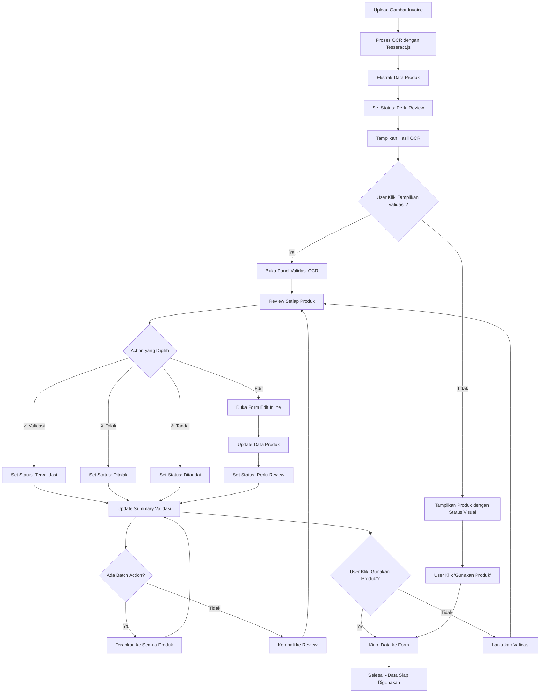
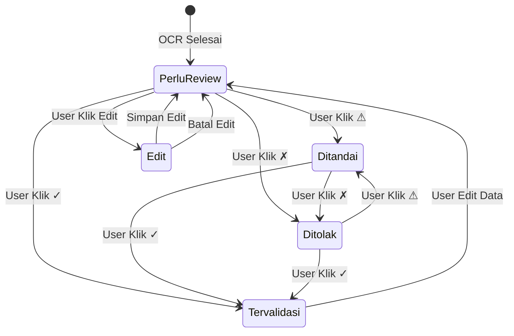
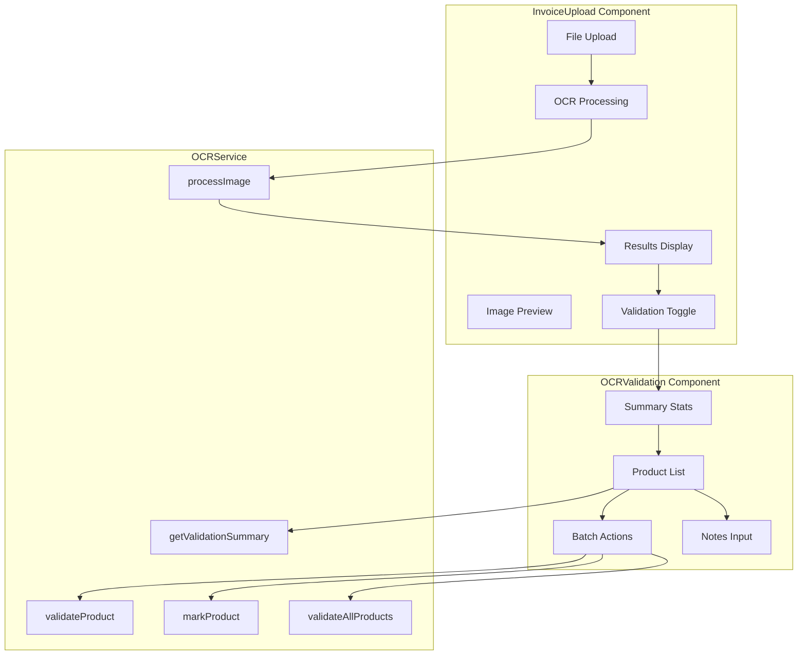
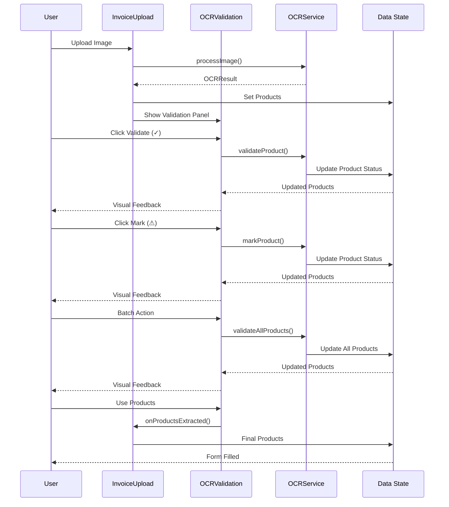

# Alur Kerja Fitur Mark OCR untuk Validasi Data

## Diagram Alur Kerja

## Status Validasi

## Komponen dan Interaksi

## Data Flow

## Fitur Utama

### 1. Validasi Individual
- Setiap produk dapat divalidasi secara individual
- Status visual yang jelas (✓ ⚠ ⏳)
- Edit inline untuk data produk
- Catatan validasi per produk

### 2. Batch Actions
- Validasi semua produk sekaligus
- Tandai semua untuk review
- Reset semua tanda validasi
- Efisiensi untuk dataset besar

### 3. Visual Feedback
- Color coding untuk status
- Icons yang intuitif
- Progress indicators
- Hover effects dan animasi

### 4. Data Integrity
- Validasi input yang robust
- Error handling yang comprehensive
- State management yang konsisten
- Optimistic updates untuk UX

## Keunggulan

1. **Akurasi**: Memastikan data OCR akurat sebelum digunakan
2. **Efisiensi**: Batch actions untuk dataset besar
3. **Fleksibilitas**: Edit data dan tambah catatan
4. **User Experience**: Interface yang intuitif dan responsif
5. **Integrasi**: Terintegrasi dengan workflow yang ada
